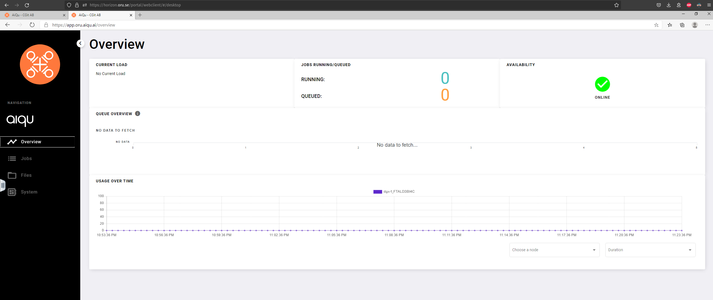

# oru-dgx

This repo is intended as a tutorial and workflow setup for the DGX Machine at Örebro University. Other than an oru.se account you won't need anything.
The goal of this tutorial is to enable you as quickly as possible to use the DGX Machine as your machine of choice to develop the newest GPU-heavy algorithms.
For the interested reader there is also a [user guide](./userguide_oru_dgx.pdf) you can read that has a stronger focus on deployment instead of development. Note that the user guide uses the terms Data Factory to refer to the DGX Machine. In this tutorial we will use the term Data Factory only to refer to the server that permanently stores data, which is separate from the DGX Machine where jobs are scheduled and the number crunching happens.
<!-- We will now go through the steps of setting up your account and installing all the necessary software for you to start using the DGX Machine. -->

## Getting the Necessary Accounts and Software

### 1. Getting an Account for the Data Factory and the DGX Machine

As of now, you have to contact the account manager of the Data Factory and the DGX Machine, Currently, this is [Andreas Persson](mailto:andreas.persson@oru.se) (14/08/2023). Write him a mail, he will fix you an account.

### 2. Setting Up Docker and Dockerhub
Your code on the DGX Machine will be running in Docker containers. It is a good idea to install the [docker-engine](https://docs.docker.com/engine/install/) on your local machine. It is also a good idea to additionally perform the [post-installation](https://docs.docker.com/engine/install/linux-postinstall/) when your local machine runs Linux. Do also create an account on [Dockerhub](https://hub.docker.com/). This allows you to build custom docker images upload them to Dockerhub and deploy them on the DGX Machine.

## Workflow

### 1. Build and Push Docker Image

First you will want to to build a docker image that has all the necessary dependencies for your project. In [docker](./docker) directory you can already find a docker file ready to be deployed on the DGX Machine (tested on 25/11/22). You can take this docker file and adapt to your needs. For instance, if you want to install additional Python packages simply modify the `requirements.txt` file or use the image as yout base image.

Here are the general steps to follow:

1. fire up a terminal type in the following command
    ```sh
    git clone https://github.com/pedrozudo/oru-dgx.git
    cd oru-dgx/docker 
    ```

2. Adapt the `build.sh` and the `push.sh` files by setting the variables.

3. Adapt the `Dockerfile` file and the `requirements.txt` file.

4. Build the image:
```sh
./build.sh
```
5. Push the image to Dockerhub:
```sh
./push.sh
```
Note that you do not want to put your own code base in your docker image, we will take care of this later one. Simply consider the docker image as the operating system you want to run on the DGX Machine.


### 2. Mounting the Data Factory

Next you will want to mount your home directory on the Data Factory on to your local machine. First, create a directory on your local machine where you want to mount the remote directory to.
```sh
mkdir -p ~/mount/datafactory
```
Now you can simply use the following command to mount the remote directory onto your local machine. Note that you need to be on the oru.se network for this (either physically or via VPN).
```sh
sshfs username@10.1.115.65:/mnt/dgx_001/aiqu_data/users/username/ ~/mount/datafactory
```
Replace in the command above `username` with your oru.se username. The password will also be your oru.se password. You can verify whether the mount was successful by running `mount | grep sshfs` which should produce:
```
username@10.1.115.65:/mnt/dgx_001/aiqu_data/users/username/ on /mount/datafactory type fuse.sshfs (rw,nosuid,nodev,relatime,user_id=1000,group_id=1000)
```

You can now use the mounted directory to transfer your prototype code and data to the Data Factory from your local machine.

Note: if you have never logged in to the Data Factory, your personal directory does not exist yet. In this case you will first have to login using the webinterface. The steps are described in the next section. 

### 3. Running Code on the DGX Machine
 Let's assume you have some code and data in the `~/mount/datafactory/AGI` directory and you want to run your algorithm on the DGX Machine now. Here is what you have to to.

 1. Go to [horizon.oru.se](https://horizon.oru.se/portal/webclient/#/launchitems), look for `oru.aiqu.se` and login. You will end up in a dashboard looking like this:
 
 2. Click on the `Jobs` tab on the left and populate the following fields:
    - Job Label: just enter the name you want your job to have
    - Image: enter the docker image (on Dockerhub) you want to use, for instance, `pedrozudo/oru-dgx:torch-2.0.1`

    Also adjust the number of GPUs you need and for how long (in minutes) you want your job to be running. You can also expose ports (see the [user guide](./userguide_oru_dgx.pdf) for further details on this).

    Next, click on `Advanced Settings` and mount the `/Home Catalog/AGI` directory.

    You are now good to go. Click on `Queue Job` and wait for your job to be scheduled.

    Once this happens, open a terminal for your job (on the far right in the job list). List the files and directories (`ls`). Your project should now be in the `AGI` directory. You can cd into it and run your algorithm
    ```sh
    cd AGI
    python agi.py
    ```

3. You will probably have a bug or two in your code which you would like to fix. On your local machine, go to the `~/mount/datafactory/AGI/` directory and fix your bug. The cool thing is that both the `~/mount/datafactory/AGI/` directory on your local machine and the `/AGI/` directory on the DGX Machine were mounted from the same directory on the Data Factory. This means that changing a file on your local machine will be reflected within the running docker image on the DGX machine. You can now code away on the DGX Machine while using the comfort of your local setup.
